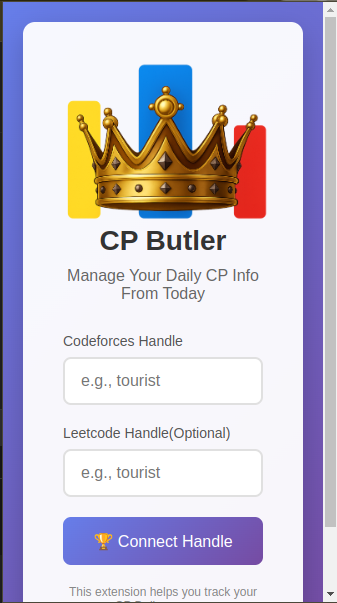
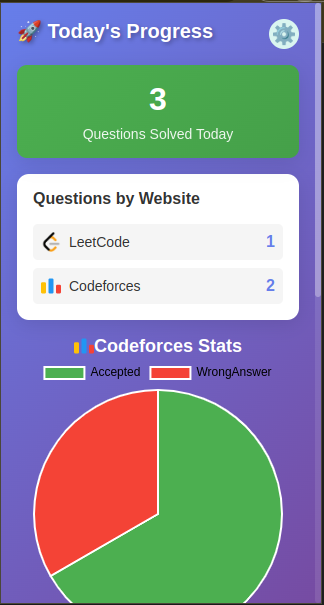

#  CP Butler

**CP Butler** is a powerful Chrome Extension built with **TypeScript + React** that helps Competitive Programmers stay on track by visualizing their daily progress across **Codeforces** and **LeetCode**.

Whether you're aiming to maintain a streak, monitor your submissions, or prepare for upcoming contests — CP Butler has your back.

---

## ✨ Features

- 📅 **Codeforces Contest Calendar**  
  See a list of all upcoming Codeforces contests right on your dashboard.

- 🧠 **Daily Solved Tracker (CF + LC)**  
  Know how many questions you've solved **today** — combined across both Codeforces and LeetCode.

- 📊 **Codeforces Submission Analysis (Pie Chart)**  
  Visualize your recent Codeforces submissions (AC, WA etc.) with a clean pie chart.

- 🏆 **Recent Codeforces Contest Standing**  
  Instantly check your latest contest rank, rating change, and performance summary from your recent Codeforces participation.

- ⚛️ **Built using React + TypeScript**  
  Modern architecture for fast UI and scalable code.

---

## 📦 Tech Stack

- 🧩 Chrome Extension APIs
- ⚛️ React
- 🟦 TypeScript
- 📡 Codeforces REST API
- 📡 LeetCode GraphQL API
- 📊 Chart.js (for visual stats)

---

## 📋 Dashboard Summary

| Section                     | Description                                           |
|-----------------------------|-------------------------------------------------------|
| 🔹 Today's Stats            | Total accepted problems on CF + LC (for today)        |
| 🔸 Submission Pie Chart     | Verdict-wise distribution of Codeforces submissions   |
| 🟢 CF Contest Calendar      | Shows all upcoming Codeforces rounds                  |
| 🟣 Recent CF Contest Result | Rank, rating change, and stats from your latest round |
| 🧠 LeetCode Tracker         | Recent accepted problems and difficulty levels        |

---

## Screenshots





---

## 🚀 Getting Started

### 1. Clone the repo

```bash
git clone https://github.com/your-username/cp-butler.git
cd cp-butler
```

### 2. Install dependencies

```bash
npm install
```

### 3. Build the extension

```bash
npm run build
```

### 4. Load in Chrome

- Go to `chrome://extensions`
- Enable **Developer Mode**
- Click **Load Unpacked**
- Select the `/dist` or `/build` folder

---

## 🛡️ Privacy First

- No account login required  
- Your usernames/handles are stored **locally** in your browser  
- No data is sent to any third-party server

---

## 🙌 Contributing

Feel free to contribute by opening issues or submitting pull requests.

### To Contribute:
1. Fork the repository  
2. Create a new branch `git checkout -b feature/amazing-feature`  
3. Make your changes  
4. Push and open a PR 🚀

---
## 📦 Releases

[](https://github.com/KingAB2004/CP-Butler/releases)

You can find the latest stable versions of this extension on the [Releases page](https://github.com/KingAB2004/CP-Butler/releases).

---
## 📄 License

This project is licensed under the MIT License.

---

## 📬 Contact

**Author**: [Arpit Bhomia]  
🔗 GitHub: [github.com/KingAB2004](https://github.com/KingAB2004)

---

> **CP Butler** — because tracking your CP journey should be as smart as your solutions 🧠💪
